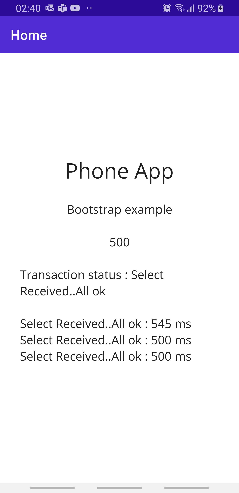

# maui_nfc_hce

## NFC-HCE Maui bootstrap example  

Ultra basic NFC HCE hello world example using .Net MAUI and VisualStudio 2022.

Tested Environment:
- Win10
- Visual Studio 2022

No need to install any Android related tools/packages (taken care of by VS2022)

- Open 'Maui_NFC_HCE.sln' using VS2022
- Build solution
- Plug your Android phone via USB
- Select appropriate target device
- Deploy / Run or Debug  

Present phone to HF reader (potentially leveraging PCSC-CL interface)

Example AID: '315041592E5359532E4444463031' (see [here](https://github.com/sylvain-prevost/maui_nfc_hce/blob/main/Platforms/Android/AndroidManifest.xml))

```
=> Perform Cold/Warm Reset
<= ATR: 3B888001000000008081710079
=> 00A404000E315041592E5359532E444446303100
<= Sw: 9000
```

Notes: 
- A delay of 500ms has been introduced in the code to simulate workload.
- Albeit NFC NDEF TAGs APIs are now available, Apple has not opened their NFC HCE API, with no indication they plan to :( , hence it is not available on iOS.

Screenshot of application running on Samsung Galaxy S8, Android v9 - API 28.

</img>


